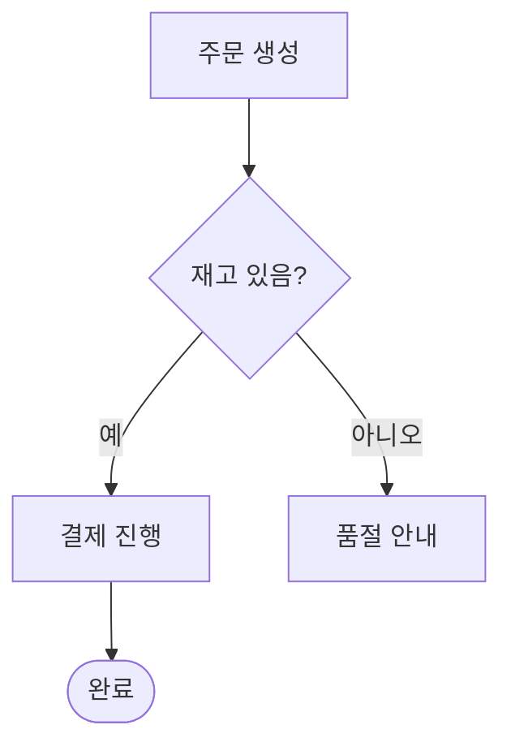

# Draw Diagram

사용자가 머릿속의 구조/흐름/관계를 다이어그램으로 보고 싶어할 때, **Mermaid 문법으로 렌더 가능한 코드 블록**을 만들어 준다.

핵심 흐름은 항상 같다.

1. **무엇을 그릴지 결정** — 아래 Decision Tree로 Mermaid 다이어그램 타입 하나를 고른다.
2. **부족한 정보를 명확화** — 해당 타입의 reference 파일을 읽고, 거기에 적힌 질문들을 `AskUserQuestion`으로 1차 질의한다.
3. **PNG로 렌더해 이미지로 첨부** — Mermaid 코드를 `mermaid.ink`로 PNG 변환해 `SendUserFile`로 채팅에 인라인 첨부한다. 사용자가 환경(CLI/모바일/웹)과 무관하게 **그림을 바로** 본다.
4. **편집 링크와 코드 블록 함께 출력** — 사용자가 직접 손볼 수 있게 `mermaid.live` 편집 링크와 원본 ` ```mermaid ` 코드 블록을 같이 보낸다.

## 1단계: 다이어그램 타입 결정

사용자의 발화에서 "무엇을 보고 싶은가"를 먼저 추출한다. 사용자가 이미 타입을 지정했다면 (예: "시퀀스 다이어그램", "ERD") 그걸 그대로 사용한다. 모호하면 아래 트리로 매핑한다.

```
사용자가 보여주고 싶은 것은?
│
├─ 의사결정/처리 흐름, 알고리즘, 분기 로직
│    → flowchart       (references/flowchart.md)
│
├─ 시간 순서로 일어나는 행위자/컴포넌트 간 메시지/호출
│    → sequenceDiagram (references/sequence.md)
│
├─ 객체의 상태와 전이 (lifecycle, FSM)
│    → stateDiagram-v2 (references/state.md)
│
├─ 구조/관계
│    ├─ OOP 클래스·메서드·상속 → classDiagram   (references/class.md)
│    ├─ DB 테이블·관계 (1:N 등) → erDiagram     (references/er.md)
│    ├─ 시스템 컴포넌트·연결    → architecture-beta (references/architecture.md)
│    └─ 시스템 컨텍스트/컨테이너 (C4 모델) → C4Context (references/c4.md)
│
├─ 시간/일정
│    ├─ 의존성·기간이 있는 프로젝트 일정 → gantt    (references/gantt.md)
│    └─ 시점 나열 (의존성 없음)           → timeline (references/timeline.md)
│
├─ 데이터 시각화
│    ├─ 전체 중 비율             → pie           (references/pie.md)
│    ├─ 2축 4분면 분류           → quadrantChart (references/quadrant.md)
│    ├─ X/Y 수치 데이터 (막대/선) → xychart-beta  (references/xychart.md)
│    └─ 흐름 + 양 (예: 에너지/예산 흐름) → sankey-beta (references/sankey.md)
│
├─ 사용자 경험 단계 + 만족도
│    → journey         (references/journey.md)
│
├─ 아이디어/주제 계층 (브레인스토밍)
│    → mindmap         (references/mindmap.md)
│
├─ Git 브랜치/머지 히스토리
│    → gitGraph        (references/gitgraph.md)
│
└─ 요구사항 추적 (requirement traceability)
     → requirementDiagram (references/requirement.md)
```

### 헷갈리기 쉬운 경계

- **flowchart vs sequence**: "누가 → 누구에게" 시간순 메시지면 sequence. 그게 아니라 박스/마름모로 흐름·분기만 보여주면 flowchart.
- **flowchart vs state**: 노드가 **상태**(예: `Pending`, `Paid`)고 화살표가 **이벤트로 인한 전이**면 state. 노드가 **할 일/단계**면 flowchart.
- **class vs ER**: 코드 레벨(메서드·상속) → class. 데이터 모델(PK/FK, 카디널리티) → ER.
- **architecture vs C4**: 서비스/큐/DB 같은 인프라 컴포넌트 간 연결을 가볍게 그리면 architecture-beta. "System Context / Container / Component" 추상화 수준을 명시적으로 다루면 C4.
- **gantt vs timeline**: 막대(기간) + 의존성이 필요하면 gantt. "언제 무엇이 있었다" 점들의 나열이면 timeline.
- **mindmap vs flowchart**: 중심 주제에서 뻗어나가는 **계층 트리**면 mindmap. 방향성 있는 처리 흐름이면 flowchart.

판단이 잘 안 서면 사용자에게 **두세 가지 후보를 짧게 제시하고 고르게 한다** (`AskUserQuestion`). 추측으로 큰 다이어그램을 다 그렸다가 갈아엎는 것보다 훨씬 싸다.

## 2단계: 명확화 질의

타입을 정한 직후, **그리기 전에** 해당 `references/<type>.md`를 읽고 그 파일에 적힌 질문들을 `AskUserQuestion`으로 묻는다. 보통 한 번에 1~3개, 진짜로 답이 다이어그램 모양을 바꾸는 것만 골라서 묻는다.

원칙:

- **이미 사용자가 답한 것을 다시 묻지 않는다.** 발화·첨부 코드·이전 답변에서 추출할 수 있으면 그걸 쓰고, 명시적으로 확인만 한다.
- **AskUserQuestion 한 번에 모든 질문을 묶어 보낸다.** 같은 자리에서 답할 수 있는 질문은 한 번의 호출로.
- **답이 없어도 합리적 기본값으로 진행할 수 있다면**, 기본값을 보기로 넣어 두고 사용자가 빠르게 수락할 수 있게 한다.
- **자동 모드(Auto Mode)에서도 1차 명확화는 한다.** Auto Mode의 "굳이 안 물어봐도 되면 묻지 마라"는 지침은, 다이어그램처럼 **사용자의 의도가 결과 모양을 직접 결정하는 산출물**에는 그대로 적용되지 않는다. 다만 질문은 짧고 본질적인 것만.

## 3단계: PNG로 렌더해 이미지로 첨부

답변이 모이면 Mermaid 코드를 짜고, **곧바로 PNG로 렌더해 `SendUserFile`로 첨부**한다. 사용자가 코드 블록 텍스트가 아니라 **그림 자체를 먼저** 보는 것이 이 스킬의 결과물이다.

다이어그램 작성 규칙:

- 사용자 텍스트가 한국어면 노드 라벨도 한국어로 쓴다. 다만 **노드 ID는 ASCII로** (한글 ID는 일부 렌더러에서 깨진다). 예: `A["주문 생성"] --> B["결제"]`.
- 라벨에 `()`, `[]`, `:`, `;`, 따옴표가 들어가면 큰따옴표로 감싼다: `A["foo (bar)"]`.
- 한 다이어그램에 모든 걸 욱여넣지 말고, 핵심을 먼저 보이고 사용자가 "더 자세히"라고 하면 그때 확장한다.

렌더·첨부 순서:

1. Mermaid 코드를 임시 파일에 저장한다: `/tmp/diagram-<짧은id>.mmd`.
2. 아래 헬퍼로 pako 인코딩 문자열을 계산한다.
3. `curl -sLf "https://mermaid.ink/img/pako:<인코딩>?type=png" -o /tmp/diagram-<짧은id>.png` 로 PNG를 받아 온다.
4. `SendUserFile` 로 `/tmp/diagram-<짧은id>.png`를 보낸다. `status="normal"`, `caption`은 한 줄 설명 (예: "주문 결제 흐름 (flowchart)").
5. 그 뒤 채팅 본문에 (a) `mermaid.live` 편집 링크 한 줄, (b) 원본 ` ```mermaid ` 코드 블록을 출력해서 사용자가 손쉽게 수정·재요청할 수 있게 한다.

렌더 끝에 짧게 한 줄로 "타입을 바꿀까요? 노드를 더 쪼갤까요?" 같은 후속 제안을 붙이면 좋다.

### 인코딩 헬퍼

`/tmp/diagram-<id>.mmd`에 mermaid 코드를 저장해 두고 호출. heredoc에 mermaid 코드를 직접 박지 말 것 — `\`, `` ` ``, `$`, 큰따옴표가 깨진다.

```bash
python3 - "/tmp/diagram-<id>.mmd" <<'PY'
import base64, zlib, json, sys
code = open(sys.argv[1]).read()
s = {"code": code, "mermaid": {"theme": "default"}}
print(base64.urlsafe_b64encode(zlib.compress(json.dumps(s).encode(), 9)).decode())
PY
```

### 다운로드/렌더 실패 시

`curl`이 실패하거나(`-f` 덕분에 4xx/5xx면 비0 종료), 받은 파일 크기가 0 이거나, 네트워크가 막힌 환경이면 **PNG 첨부는 건너뛴다**. 빈 파일은 절대 `SendUserFile`로 보내지 않는다. 대신 채팅에 다음을 출력한다:

- "지금 환경에서 외부 렌더 서비스(`mermaid.ink`)를 못 잡아서 이미지 첨부를 건너뛰었어요. 코드 블록과 편집 링크로 대신 보냅니다." 한 줄
- `mermaid.live` 편집 링크
- ` ```mermaid ` 코드 블록

## 4단계: 민감 정보 가드

`mermaid.ink`/`mermaid.live`는 **외부 서비스**다. 인코딩된 다이어그램 코드가 그 서버를 거친다. 다음 중 하나라도 다이어그램에 포함돼 있다면 PNG 첨부와 편집 링크 둘 다 만들지 말고, 코드 블록만 출력한 뒤 사용자에게 "외부 렌더 서비스로 보내도 괜찮을지" 한 번 묻는다.

- 사내 시스템/도메인/팀 이름이 식별 가능한 형태
- 고객/사용자 식별 정보(이메일, 사번, 전화)
- API 키·토큰·시크릿
- 미공개 기능명, 비공개 프로젝트 코드명

사용자가 "외부 OK"라고 명시했거나, 다이어그램이 공개해도 무방한 일반 예시(샘플 도메인, 가짜 데이터, 공개된 오픈소스 구조 등)면 그냥 첨부한다.

### 한 번 마무리 예시

`SendUserFile` 호출 후 채팅에 다음을 출력:

````
편집·테마 변경: https://mermaid.live/edit#pako:eNpVkMEKwjAMhl-l5KSg0Lk6owfFbb6BN-uhTTsUnIJseBh7d9MMBHsIhP_LF9IB6BUi7BQ0j9eHbu7dqXNtn4rf8WLB9oQN2d77HBU3OgSuWZ5ZuKrlcq_KQaCNY8hR1AnaIKZq6GBhnFwlwykqNMpYJW5HXqcNGaVsS8b2YY1bdv9PrQ0nfkVJW6yMGGoxBCO7UOPEceO1Nz9DJexpNp1SiAeJOJ_DQkEb3627B75_gO4WW_mJEBvXPzoYxy8-PlOQ


````

## 참고 파일

각 다이어그램 타입의 **명확화 질문 + 최소 문법 예시 + 자주 하는 실수**는 아래 파일에 있다. 타입이 정해지면 그 파일 하나만 읽으면 된다.

- `references/flowchart.md`
- `references/sequence.md`
- `references/state.md`
- `references/class.md`
- `references/er.md`
- `references/architecture.md`
- `references/c4.md`
- `references/gantt.md`
- `references/timeline.md`
- `references/pie.md`
- `references/quadrant.md`
- `references/xychart.md`
- `references/sankey.md`
- `references/journey.md`
- `references/mindmap.md`
- `references/gitgraph.md`
- `references/requirement.md`
