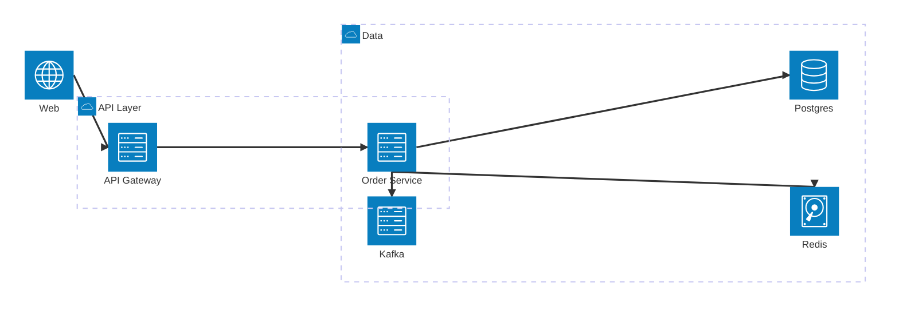

# Architecture Diagram (architecture-beta)

서비스/큐/DB/외부 시스템 같은 인프라 컴포넌트들과 그들의 연결을 가볍게 표현.

## 그리기 전에 물어볼 것 (AskUserQuestion)

1. **다이어그램의 범위(scope)** — 전체 시스템 상위 그림인지, 한 서비스의 인접 컴포넌트인지.
2. **포함할 컴포넌트** — 서비스, DB, 큐, 캐시, 외부 API 등 어떤 박스들이 등장할지.
3. **그룹핑** — 클라우드/VPC/팀별로 묶을 필요가 있는가? (`group` 사용 여부)
4. **연결의 방향성/프로토콜 표시** — 단순 선만 그릴지, "HTTP/gRPC/event" 같은 라벨을 붙일지.

C4 모델 표기(System Context, Container, Component)를 명시적으로 다루고 싶다면 `architecture-beta` 대신 `c4.md`를 본다.

## 최소 문법

- `service <id>(<icon>)[<label>] in <group>` 형태.
- 아이콘은 빌트인: `cloud`, `database`, `disk`, `internet`, `server`. (커스텀 아이콘 등록도 가능하지만 보통 빌트인으로 충분)
- 연결 방향에 면(face)을 지정: `L`(left), `R`(right), `T`(top), `B`(bottom). 예: `a:R --> L:b`.

## 자주 하는 실수

- 컴포넌트가 너무 많음(>15) → 한눈에 안 들어옴. 그룹으로 묶거나 다이어그램을 계층별로 나눠라.
- 면(face) 지정을 빠뜨려서 연결선이 이상하게 꼬임 → 항상 `:R/:L/:T/:B`를 지정.
- 데이터 흐름 vs 제어 흐름을 섞음 → 한 다이어그램에선 한 종류로. 둘 다 보여줘야 하면 라벨로 구분.
