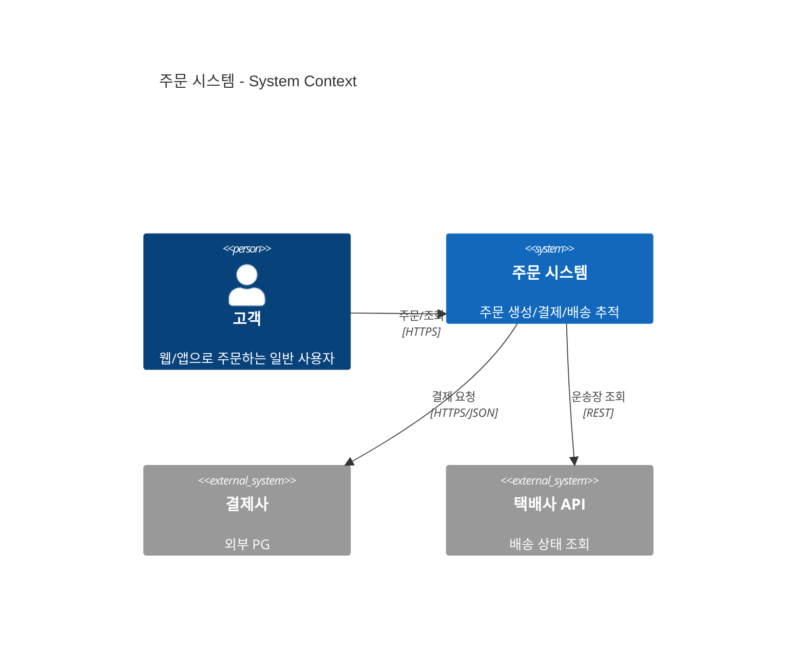
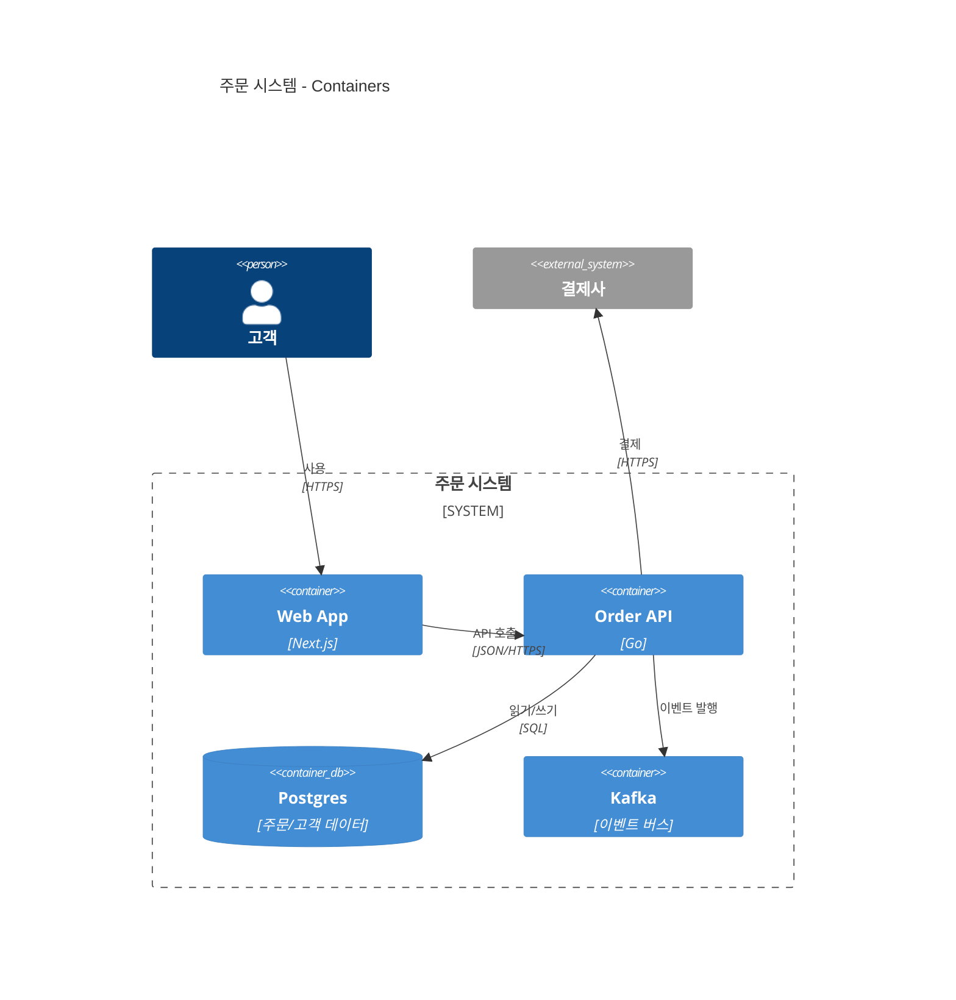

# C4 Diagram

Simon Brown의 C4 모델: System Context → Container → Component → Code. Mermaid는 상위 3단계를 지원한다 (`C4Context`, `C4Container`, `C4Component`, `C4Dynamic`, `C4Deployment`).

## 그리기 전에 물어볼 것 (AskUserQuestion)

1. **어느 추상화 수준인가** — 사용자가 그리고 싶은 게:
   - System Context: 시스템 하나와 외부 사용자/시스템 → `C4Context`
   - Container: 시스템 안의 앱/서비스/DB 단위 → `C4Container`
   - Component: 한 컨테이너 안의 모듈/패키지 → `C4Component`
   - Deployment: 인프라/노드에 배포된 모양 → `C4Deployment`
2. **중심 시스템(System under design)** — 무엇을 중심에 두는가? 이름과 한 줄 설명.
3. **외부 행위자/시스템** — 누가 이 시스템을 쓰는가, 어떤 외부 시스템과 통신하는가.
4. **관계 라벨 디테일** — 프로토콜/기술(`HTTPS/JSON`)을 표기할지, 그냥 한국어 설명만 할지.

C4 모델을 모르거나 그냥 가벼운 아키텍처 그림이면 `architecture-beta`가 더 편하다 (`architecture.md` 참고).

## 최소 문법 — System Context

## 최소 문법 — Container

- 요소: `Person`, `System`, `System_Ext`, `Container`, `ContainerDb`, `ContainerQueue`, `Component`, `Boundary`, `System_Boundary`, `Enterprise_Boundary`.
- 관계: `Rel(from, to, "설명", "기술")`. 방향 지정 변형도 있다: `Rel_R`, `Rel_L`, `Rel_U`, `Rel_D`.

## 자주 하는 실수

- 한 다이어그램에 추상화 레벨을 섞음 (Container 안에 외부 사용자 Person이 등장) → 각 레벨은 명확히 분리.
- System under design을 명시 안 함 → 어디서부터 "우리 시스템"인지 모호. 항상 `System_Boundary`로 감싸라.
- 관계 화살표가 너무 많아서 그물 → 핵심 관계만 남기고 자세한 건 다음 레벨 다이어그램으로.
