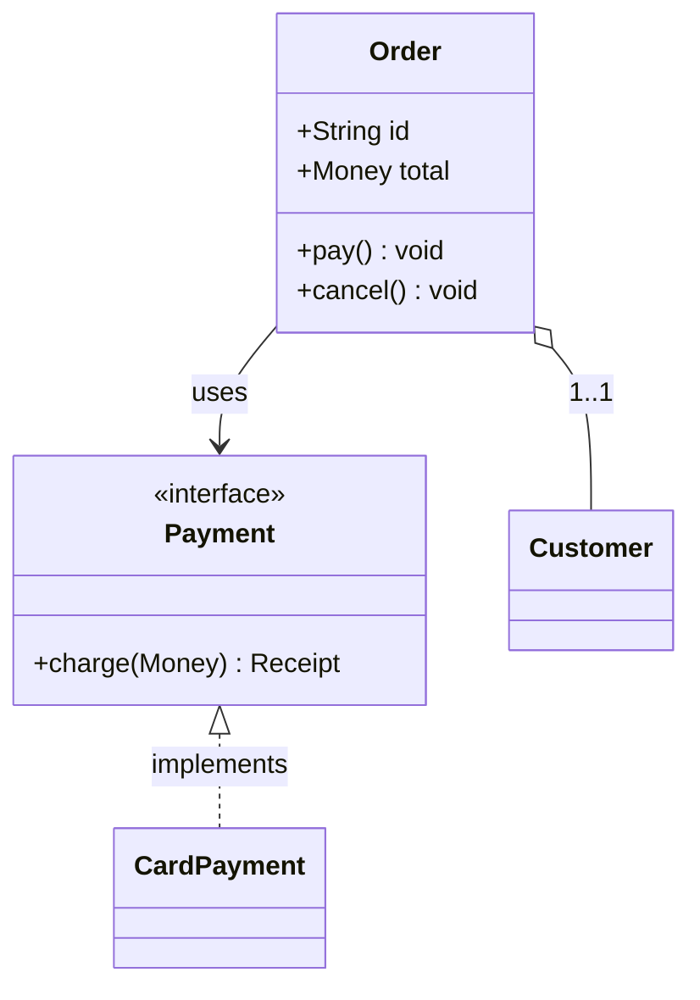

# Class Diagram

OOP 클래스/인터페이스의 구조, 멤버, 상속·구현·연관 관계.

## 그리기 전에 물어볼 것 (AskUserQuestion)

1. **포함할 클래스 목록** — 어떤 클래스를 그릴지. (코드가 있으면 추출 후 확인만)
2. **얼마나 상세하게** — 다음 중 무엇을 보여줄지:
   - 클래스 이름만
   - + 주요 public 필드/메서드 시그니처
   - + private/protected까지 전부 (`+ - #`)
3. **관계 표시** — 보여줄 관계 종류:
   - 상속/구현 (`<|--`, `<|..`)
   - 합성/집합 (`*--`, `o--`)
   - 단순 연관/의존 (`-->`, `..>`)
   - 다중도(multiplicity) 표기 여부

너무 자세하면 다이어그램이 안 읽힌다. 보통 "이름 + 핵심 메서드 몇 개 + 관계"가 적정.

## 최소 문법

- 가시성: `+ public`, `- private`, `# protected`, `~ package`.
- 스테레오타입: `<<interface>>`, `<<abstract>>`, `<<enum>>`.
- 관계:
  - `<|--` 상속, `<|..` 인터페이스 구현
  - `*--` composition, `o--` aggregation
  - `-->` association, `..>` dependency

## 자주 하는 실수

- 한 다이어그램에 클래스 20개 이상 욱여넣음 → 의미 있는 서브셋만. 큰 시스템은 모듈별로 나눠라.
- 데이터 모델(테이블·관계)을 class로 그림 → **ERD가 더 적합**. PK/FK·카디널리티를 그리고 싶으면 `er.md` 참고.
- 라벨에 `<>`나 `()` 들어가서 깨짐 → 따옴표로 감싸거나 단순화.
