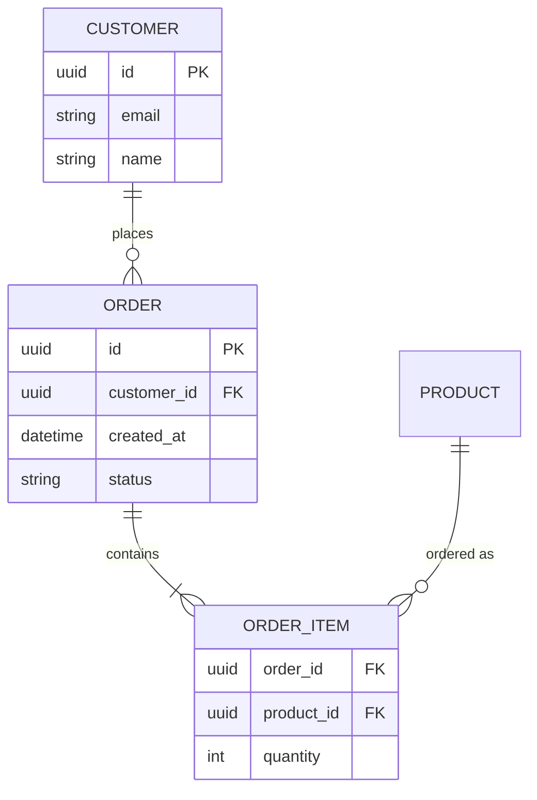

# ER Diagram

데이터 모델: 엔티티(테이블), 속성, 그리고 카디널리티가 표시된 관계.

## 그리기 전에 물어볼 것 (AskUserQuestion)

1. **엔티티 목록** — 어떤 테이블/엔티티를 그릴지. (스키마/모델 파일이 있으면 추출 후 확인만)
2. **속성을 어디까지 보여줄지**:
   - 엔티티 이름만 (관계 중심)
   - + 주요 컬럼 (PK/FK 위주)
   - + 모든 컬럼 + 타입
3. **관계의 카디널리티** — 1:1 / 1:N / N:M 어느 정도로 정확히 표시할지. 양쪽 모두에 optionality(필수/선택)도 표시할지.
4. (선택) **N:M 연결 테이블(junction table)** 을 명시적으로 그릴지, 단순히 N:M 관계선 하나로 처리할지.

## 최소 문법

- 카디널리티 기호 (왼쪽–오른쪽 형태로 읽는다):
  - `||--||` 정확히 1 ↔ 1
  - `||--o{` 1 ↔ 0..N
  - `||--|{` 1 ↔ 1..N
  - `}o--o{` N ↔ M (양쪽 선택)
- 키 마커: `PK`, `FK`, `UK`.

## 자주 하는 실수

- 카디널리티를 거꾸로 그림 → "왼쪽 엔티티에서 본 오른쪽 엔티티의 수"가 오른쪽 기호. 헷갈리면 한 줄씩 자연어로 검증.
- 컬럼을 다 적어서 그림이 거대해짐 → PK/FK + 사람이 쿼리할 만한 컬럼만.
- N:M인데 junction table을 그리지 않음 → 실제 DB 구현과 어긋남. 관계에 추가 속성이 있다면 반드시 junction을 그려라.
