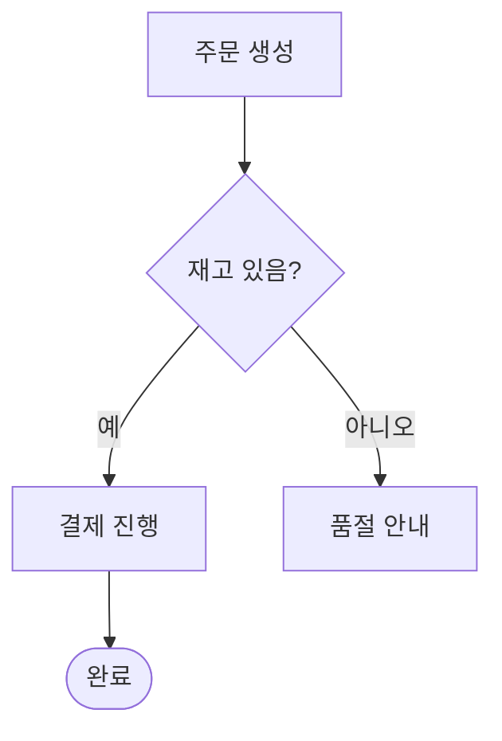

# Flowchart

처리 흐름·분기·알고리즘을 박스와 화살표로.

## 그리기 전에 물어볼 것 (AskUserQuestion)

다음 중 사용자 발화로부터 추출되지 않은 것만 물어본다. 한 번의 `AskUserQuestion` 호출에 묶어 보낸다.

1. **방향** — 위→아래(`TD`)인가, 왼→오(`LR`)인가?
   - 단계가 많고 길면 `LR`이 보통 더 읽기 좋다. 5단계 이내면 `TD`가 자연스럽다.
   - 옵션: `TD (위→아래)`, `LR (왼→오)`, `BT`, `RL`.
2. **시작점과 끝점** — 흐름의 entry/exit가 무엇인가? (예: "사용자가 결제 버튼 클릭" → "주문 완료/실패")
3. **포함할 분기/예외** — 정상 경로만 그릴까, 실패·예외도 같이 그릴까?
   - 분기 노드(마름모)가 너무 많으면 가독성이 급격히 떨어진다. 2~4개가 적정.
4. (선택) **swim lane이 필요한가** — 행위자별 구역을 나누고 싶으면 `subgraph`로 묶는다. 필요 없으면 묻지 않는다.

이미 코드/스펙이 첨부돼 있어 흐름이 명확하면 1번(방향)만 묻고 바로 그린다.

## 최소 문법

- 노드 모양: `A[사각]`, `A(둥근)`, `A([스타디움])`, `A{마름모}`, `A((원))`, `A[/평행사변형/]`.
- 엣지 라벨: `A -- 텍스트 --> B` 또는 `A -->|텍스트| B`.
- 그룹: `subgraph 이름 ... end`.

## 자주 하는 실수

- 한글 ID 사용 → 일부 렌더러에서 깨짐. **ID는 ASCII, 라벨만 한글**.
- 라벨에 `()`나 `:` 들어갈 때 따옴표 안 씌움 → 파싱 에러. `A["foo: bar"]`.
- 모든 예외 케이스를 한 그림에 다 그림 → 메인 흐름이 안 보임. 핵심 정상 경로 + 한두 개 주요 분기로 시작.
