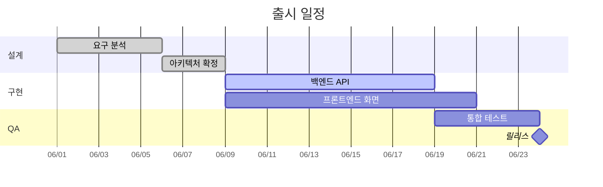

# Gantt Chart

기간이 있는 태스크와 그들 사이의 의존성으로 본 프로젝트 일정.

## 그리기 전에 물어볼 것 (AskUserQuestion)

1. **프로젝트 제목과 기간 단위** — 일(day) / 주(week) / 시간(hour) 중 무엇으로 표시할지. 시작일.
2. **섹션 구분** — 태스크를 어떤 묶음(섹션)으로 그룹화할지. (예: "설계", "구현", "QA"). 한두 개여도 됨.
3. **태스크 목록 + 각 태스크의 (시작 또는 의존성, 기간, 상태)** — 한꺼번에 받기 어려우면 표 형태로 적어달라고 한다.
4. **이정표(milestone) 여부** — 특정 시점(릴리스일 등)을 점으로 찍을지.

## 최소 문법

- 태스크 형식: `이름 : [상태], [id], [시작|after id], 기간`.
- 상태: `done`, `active`, `crit` (혹은 조합 `crit, active`).
- `milestone`은 기간 `0d`.
- `after id1 id2` 처럼 복수 의존성도 가능.

## 자주 하는 실수

- 의존성을 표시하지 않고 모든 태스크에 절대 날짜를 박음 → 일정 한 칸만 바뀌어도 전체 수정. 가능하면 `after`로 묶어라.
- 너무 잘게 쪼갠 태스크(>30개)를 한 차트에 → 읽기 어렵다. 상위 일정만 보이고 디테일은 별도.
- 한국어 태스크 이름에 `:` 들어가서 파싱 깨짐 → 콜론 제거하거나 다른 구분자로 대체.
