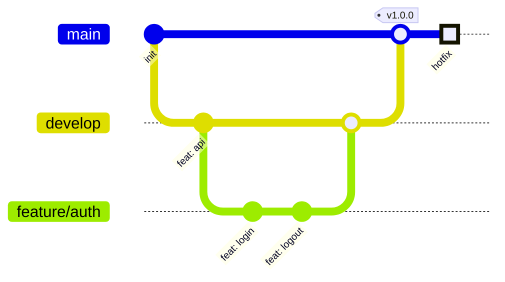

# Git Graph (gitGraph)

브랜치/커밋/머지로 표현된 Git 히스토리.

## 그리기 전에 물어볼 것 (AskUserQuestion)

1. **표현 목적** — 실제 저장소 상태를 시각화? 가르치는 예시(브랜치 전략 설명)? 둘에 따라 디테일 수준이 달라진다.
2. **포함할 브랜치** — `main`만? `main` + `develop` + 피처 브랜치?
3. **머지 전략** — `merge`(머지 커밋 생성) / `cherry-pick` / fast-forward. 어느 것을 보여줄지.
4. **태그(release) 표시 여부** — `v1.0.0` 같은 태그를 찍을지.
5. (선택) **방향** — 가로(`LR`, 기본) / 세로(`TB`).

실제 저장소를 시각화한다면 사용자에게 `git log --graph --oneline` 결과를 받아 매핑해도 좋다.

## 최소 문법

- `commit` 옵션: `id:`, `tag:`, `type: NORMAL|REVERSE|HIGHLIGHT`.
- `branch <name>` 으로 분기 생성, `checkout <name>` 으로 전환, `merge <name>` 으로 머지.
- `cherry-pick id: "<hash>"` 도 가능.

## 자주 하는 실수

- `checkout`을 빼먹고 다른 브랜치에 커밋하려 함 → 항상 현재 브랜치 의식.
- 머지 방향 헷갈림 → "내가 있는 브랜치에 상대를 머지한다". `develop`에서 `merge feature/x`면 feature → develop.
- 너무 많은 브랜치/커밋 → 메시지가 안 보임. 핵심만 추려라.
