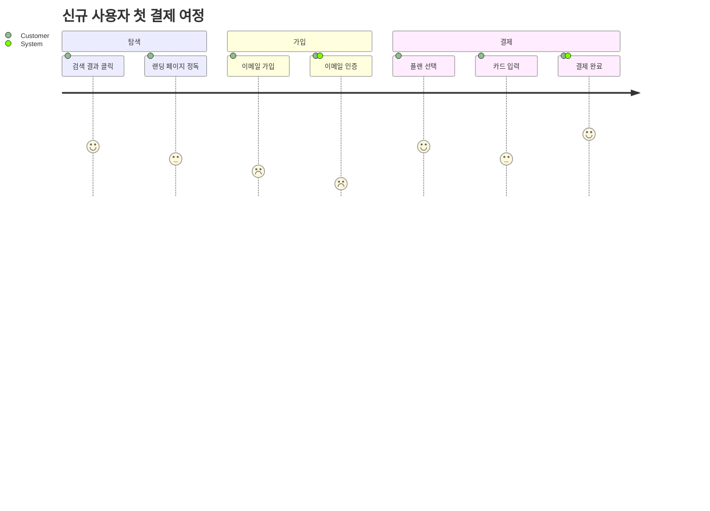

# User Journey

사용자가 어떤 목표를 달성하기 위해 거치는 단계와, 각 단계에서의 만족도(1~5).

## 그리기 전에 물어볼 것 (AskUserQuestion)

1. **여정의 제목** — 어떤 시나리오인가? (예: "신규 사용자 첫 결제", "환불 신청")
2. **단계의 그룹(섹션)** — 보통 큰 단계로 묶는다 (예: "탐색", "가입", "구매").
3. **각 단계와 (만족도, 관여 행위자)** — 단계 이름, 1~5점, 누가 관여했는지(예: "Customer, Support").
4. (선택) **관점** — 사용자 1인의 여정인가, 여러 페르소나를 비교하는가. (Mermaid는 한 여정 전제이므로 페르소나별로 분리)

만족도 점수가 비교 의미가 없으면 (예: 단순히 단계만 보여주고 싶음) flowchart나 timeline이 더 나을 수 있다.

## 최소 문법

- 형식: `단계 이름: 점수(1~5): 행위자[, 행위자...]`.

## 자주 하는 실수

- 점수에 0이나 6 같은 범위 밖 숫자 사용 → 깨짐. 1~5만.
- 모든 단계 점수가 5 (혹은 모두 3) → 의미 없음. 솔직한 마찰점 평가가 핵심.
- 시스템 인터랙션 다이어그램으로 오용 → 그건 sequence가 맞다. journey는 **사람의 경험** 중심.
