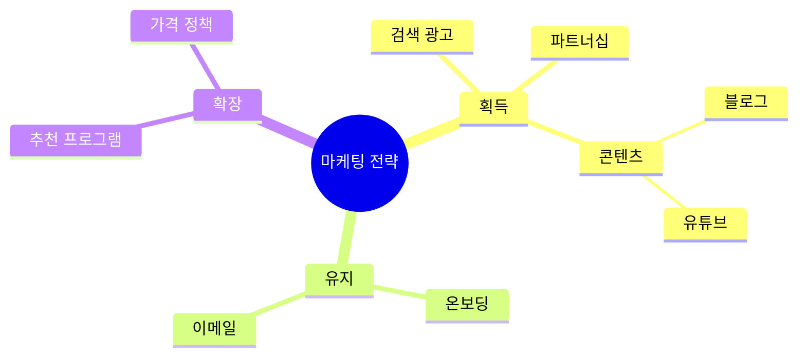

# Mindmap

중심 주제에서 가지로 뻗어나가는 계층 트리.

## 그리기 전에 물어볼 것 (AskUserQuestion)

1. **중심 주제(root)** — 한 단어 또는 짧은 문구.
2. **최대 깊이** — 2단계? 3단계? 너무 깊으면 가독성 추락 (보통 2~3).
3. **각 1차 가지(메인 카테고리)와 그 하위 항목** — 한꺼번에 나열해 달라고 한다. (자주 잊는 게 있는지 확인용으로 "더 추가할 게 있는가?"도 물어봐도 좋다)
4. (선택) **노드 모양/아이콘** — 강조하고 싶은 노드를 다른 모양으로 할지.

브레인스토밍이 아니라 **방향성 있는 처리 흐름**이면 flowchart가 적합. 노드들이 자식이 아니라 동등한 정보면 list로 충분.

## 최소 문법

- 들여쓰기로 계층을 표현. 같은 깊이면 자매(sibling).
- 노드 모양: `((원))`, `(둥근)`, `[사각]`, `{{육각}}`, `)물방울(`, `))폭발((`. 미지정 시 자동.

## 자주 하는 실수

- 들여쓰기 단위가 일관되지 않음 → 파싱 오류. 2칸 또는 4칸으로 통일.
- 한 가지에 자식이 10개 넘음 → 인지 한계. 7±2 룰. 더 많으면 카테고리로 한 단 묶어라.
- 가지 간에 화살표 연결을 그리려고 함 → mindmap은 트리. 교차 연결이 필요하면 flowchart로.
