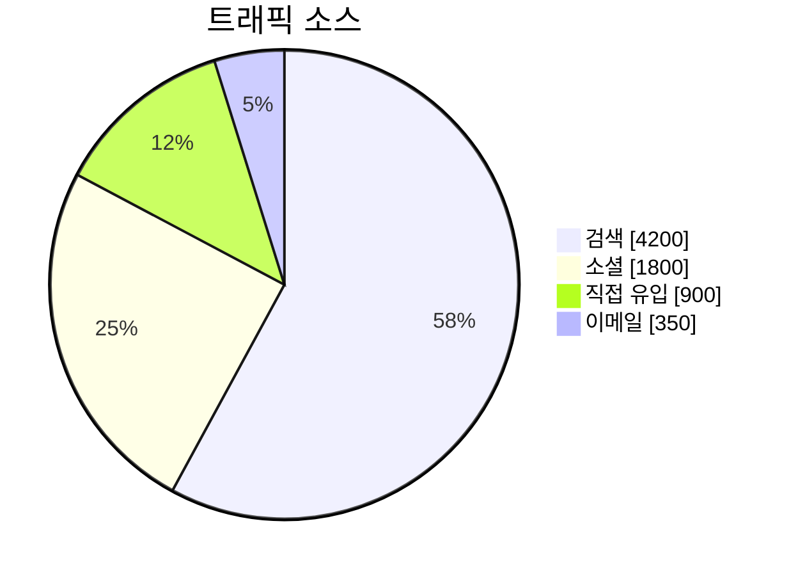

# Pie Chart

전체 100% 중 각 항목의 비율.

## 그리기 전에 물어볼 것 (AskUserQuestion)

1. **카테고리와 값** — 항목 이름과 수치. (값이 비율인지 절대값인지 — Mermaid는 자동으로 비율 계산하므로 절대값이어도 OK)
2. **차트 제목**.
3. **값 표시 형식** — 슬라이스에 절대값을 띄울지(`showData`), 그냥 비율만 표시할지.
4. (선택) **카테고리 수가 많을 때** — 5개를 넘으면 가독성이 떨어진다. 작은 항목들을 "Others"로 묶을지 사용자에게 확인.

## 최소 문법

- `showData`를 빼면 비율(%)만 표시.

## 자주 하는 실수

- 비교 목적(시간에 따른 변화)에 pie 사용 → bar/line이 적절. **하나의 스냅샷**에만.
- 항목이 너무 많거나(>7) 비율이 비슷비슷 → 차이가 안 보임. Pareto 식으로 상위 N개 + Others.
- 음수/0 값 — pie에는 의미 없음. 사전에 정리.
