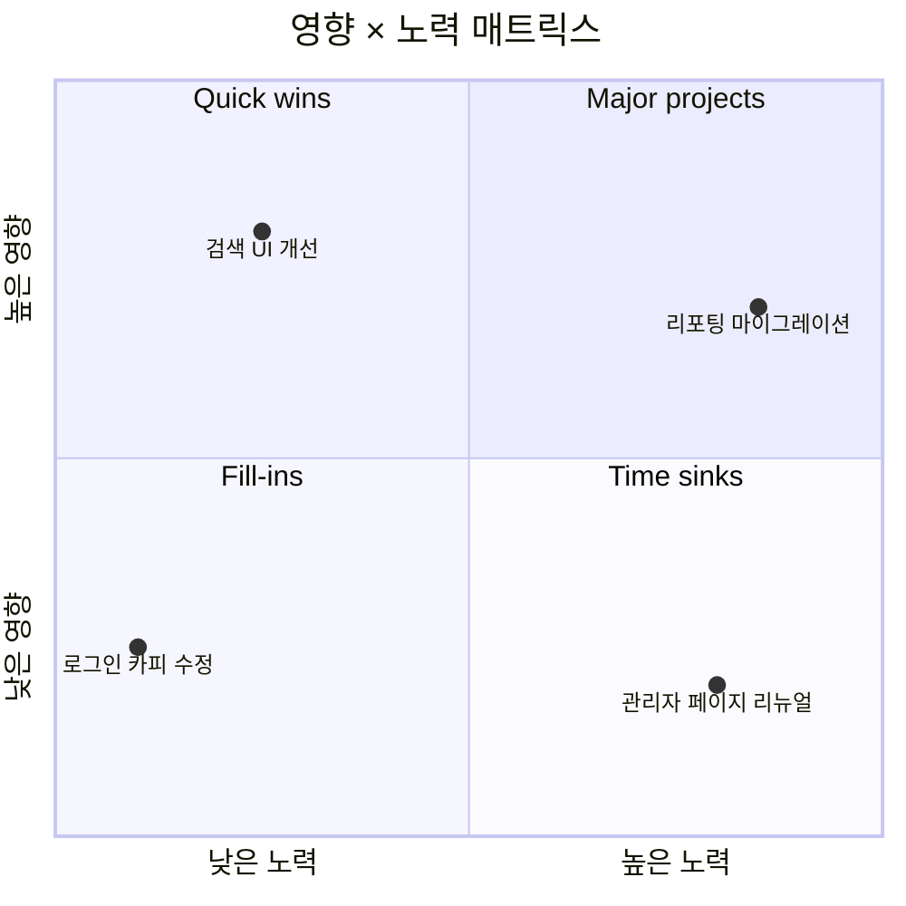

# Quadrant Chart

2축 기준 4분면에 항목을 배치하는 매트릭스 (예: 중요도×긴급도, 영향×노력).

## 그리기 전에 물어볼 것 (AskUserQuestion)

1. **두 축의 이름과 의미** — X축은 무엇(낮음↔높음)? Y축은 무엇(낮음↔높음)?
2. **4분면의 라벨** — 각 사분면을 어떻게 부를지. (예: "Quick wins", "Major projects", "Fill-ins", "Time sinks")
3. **점으로 찍을 항목과 좌표** — 항목 이름과 (x, y) 위치. x/y는 0~1 사이의 상대값.
4. (선택) **항목 묶음/색상** — 카테고리별로 그룹 표시할지.

만약 사용자가 좌표(0~1)를 직접 못 정하겠다고 하면, "X에서 상/중/하, Y에서 상/중/하"로 받아서 매핑(0.85/0.5/0.15)해도 된다.

## 최소 문법

- `quadrant-1`은 우상단, `quadrant-2`는 좌상단, `quadrant-3`은 좌하단, `quadrant-4`는 우하단. (헷갈리기 쉬움 — 항상 확인)

## 자주 하는 실수

- 사분면 라벨 위치를 잘못 줌 (`quadrant-1`을 좌상단으로 착각) → 항상 시계 방향이 아니라 위 순서 기억.
- 항목이 너무 많아 점들이 겹침 → 핵심 5~10개만.
- 축이 명목(nominal) 변수임 (예: "팀 A vs 팀 B") → quadrant 부적합. 두 축이 모두 **연속적인 정도**여야 한다.
