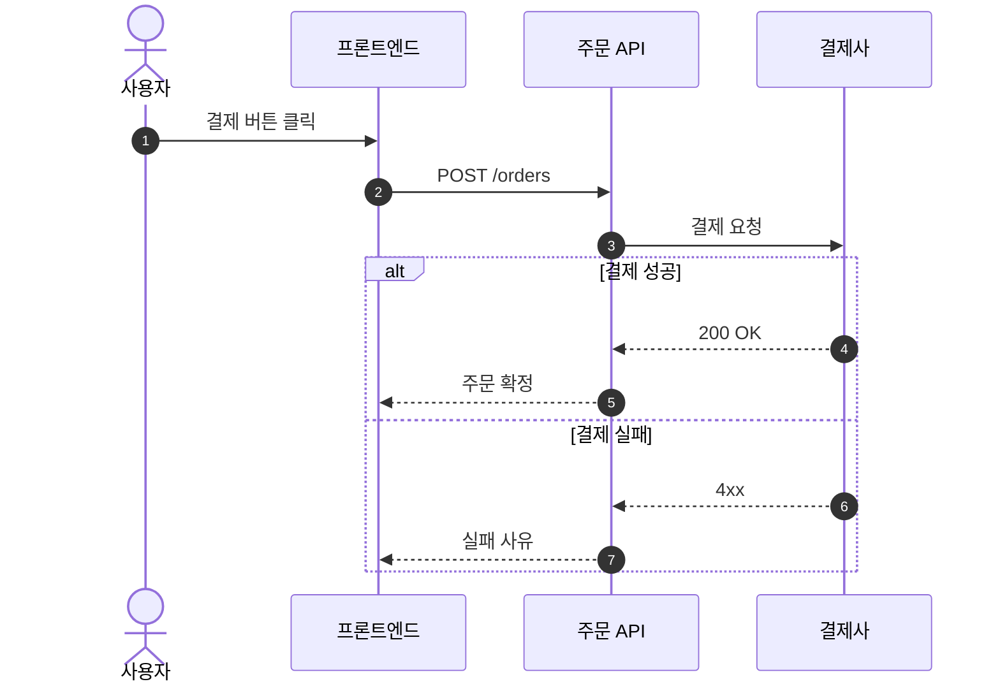

# Sequence Diagram

행위자(actor/시스템)들 사이에 시간순으로 오가는 메시지·호출.

## 그리기 전에 물어볼 것 (AskUserQuestion)

1. **참여자(participants)** — 누가/무엇이 등장하는가? (예: 사용자, 프론트엔드, API 서버, DB, 외부 결제사)
   - 코드/스펙에 명확하면 묻지 않고 확인만.
2. **다룰 시나리오** — 정상 흐름 하나만? 아니면 실패/타임아웃/재시도 같은 대안 흐름도 같이?
   - `alt`/`opt`/`loop` 블록을 쓸지 결정한다.
3. **동기/비동기 구분 표시 여부** — 일반 화살표(`->>`)만 쓸지, 비동기(`-)>`) 와 응답(`-->>`)을 구분할지.
4. (선택) **활성화 막대(activation)** — 호출 중인 구간을 막대로 표시할지. 짧은 다이어그램이면 생략해도 무방.

## 최소 문법

- 동기 호출: `A->>B`, 응답: `B-->>A`, 비동기: `A-)B`.
- 그룹 블록: `alt/else`, `opt`, `loop`, `par`, `critical`, `break`.
- 노트: `Note over A,B: 텍스트`.

## 자주 하는 실수

- 한 화살표 라벨에 너무 긴 설명 → 줄바꿈은 ` ` 사용. 더 길면 `Note`로 빼라.
- 분기를 일반 화살표로 나란히 그려서 시간순처럼 보이게 만듦 → 반드시 `alt/else` 블록 사용.
- 참여자 너무 많음 (>6) → 가독성 급락. 같은 책임은 한 participant로 묶거나 다이어그램을 나눠라.
