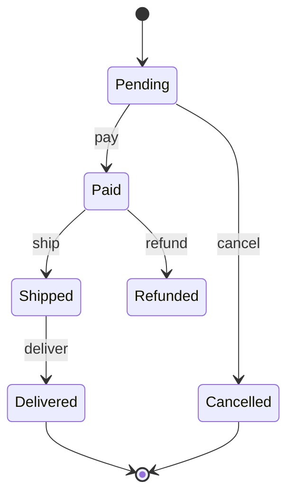

# State Diagram (stateDiagram-v2)

객체/리소스의 **상태**와, 이벤트로 인한 **상태 전이**.

## 그리기 전에 물어볼 것 (AskUserQuestion)

1. **대상 엔티티** — 무슨 객체의 상태인가? (예: 주문, 구독, 작업 잡)
2. **상태 목록** — 어떤 상태들이 있는가? (사용자가 코드/스펙으로 이미 줬으면 추출 후 확인만)
3. **전이를 일으키는 이벤트** — 화살표에 붙일 트리거. (예: `pay`, `cancel`, `expire`)
4. (선택) **복합 상태(composite)** — 한 상태 안에 하위 상태가 있는가? 없으면 묻지 않는다.
5. (선택) **종료 상태가 여러 개인가** — 정상 종료 / 실패 종료 / 취소 종료를 구분하고 싶은가.

## 최소 문법



- 시작/종료: `[*]`.
- 전이 라벨에 이벤트 이름을 적는다: `A --> B: event`.
- 복합 상태:
  ```
  state Active {
      [*] --> Idle
      Idle --> Working: start
      Working --> Idle: done
  }
  ```
- 선택 분기: `state choice <<choice>>` 노드 사용 가능.

## 자주 하는 실수

- 노드가 **상태가 아니라 동작**임 (예: "결제하기") → 그건 flowchart에 가깝다. 상태는 명사형(`Paid`, `Shipped`).
- 한 상태에서 같은 이벤트로 가는 화살표를 여러 개 그림 → 어디로 갈지 모호. `choice` 노드 사용.
- 종료가 없음 → `[*]`로 명확히 종료를 표시해야 lifecycle이 닫힌다.
