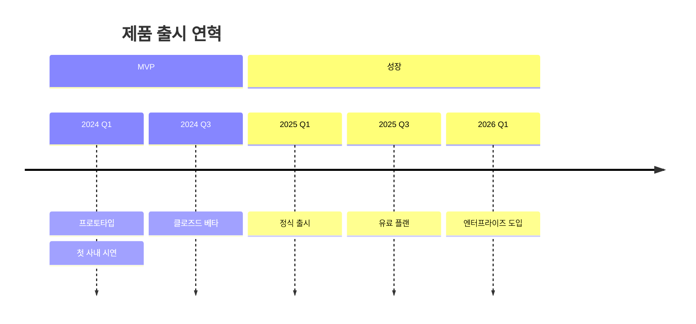

# Timeline

시점들을 시간 순으로 나열. 기간/의존성이 없다는 점에서 Gantt와 다르다.

## 그리기 전에 물어볼 것 (AskUserQuestion)

1. **시간 축 단위** — 연도 / 분기 / 월 / 날짜 중 무엇으로 묶을지.
2. **그룹화(section) 필요 여부** — 시간을 큰 단계(예: "MVP 시기", "성장기")로 나눌지, 그냥 한 줄로 쭉 나열할지.
3. **각 시점에 들어갈 항목 수** — 한 시점에 이벤트 하나만? 여러 개 나열?
4. (선택) **강조할 시점** — 특별히 두드러지게 보일 이벤트가 있는지.

## 최소 문법

- 시점 한 줄에 항목을 여러 개 넣으려면 `:` 로 이어서 적는다.
- `section`은 선택. 안 쓰면 평평한 타임라인.

## 자주 하는 실수

- 기간/의존성이 있는 일정을 timeline으로 그림 → **Gantt**가 더 적합.
- 한 시점에 너무 긴 텍스트 → 칸이 좁아 잘림. 짧게 끊고 여러 줄로 나눠라.
- 시간 라벨 형식이 들쭉날쭉 ("2024년 1월", "2024-Q1", "Jan 2024" 혼재) → 통일.
