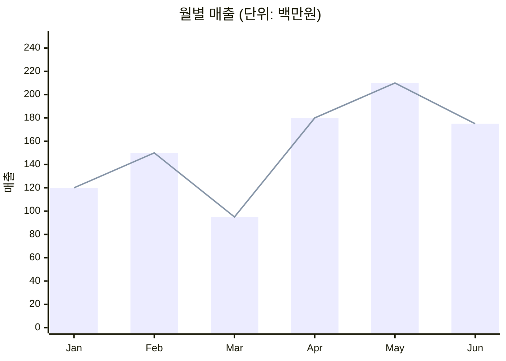

# XY Chart (xychart-beta)

X축에 카테고리(또는 수치), Y축에 수치를 두는 막대/선 차트.

## 그리기 전에 물어볼 것 (AskUserQuestion)

1. **차트 종류** — `bar` / `line` / 둘을 겹쳐 그리기 중 어느 것?
2. **방향** — 가로(`horizontal`) / 세로(기본).
3. **X축 데이터** — 카테고리 라벨 (예: 월: Jan, Feb, ...) 또는 수치 범위.
4. **Y축 데이터와 범위(min~max)** — 시리즈가 여러 개면 각각.
5. **제목 + 축 라벨**.

## 최소 문법

- 한 차트에 `bar`와 `line`을 동시에 그릴 수 있다 (이중 표현).
- 가로 차트: 첫 줄에 `xychart-beta horizontal`.

## 자주 하는 실수

- 시계열 데이터가 균일하지 않은데 카테고리 라벨로만 표시 → 간격 왜곡. 데이터가 진짜 시간이면 균등 샘플이거나 라벨에 날짜 명시.
- Y축 범위를 0부터 안 잡고 좁게 잡아 차이가 과장됨 → 분석용이면 그대로, 보고용이면 0부터.
- 시리즈 이름/범례를 못 붙임 → Mermaid xychart-beta는 다중 시리즈/범례 지원이 제한적. 복잡한 비교는 다른 도구를 권장.
